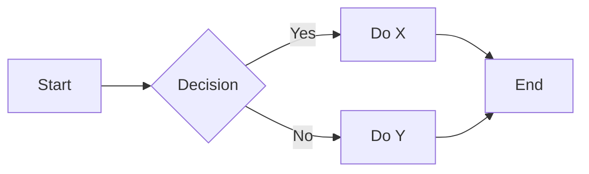
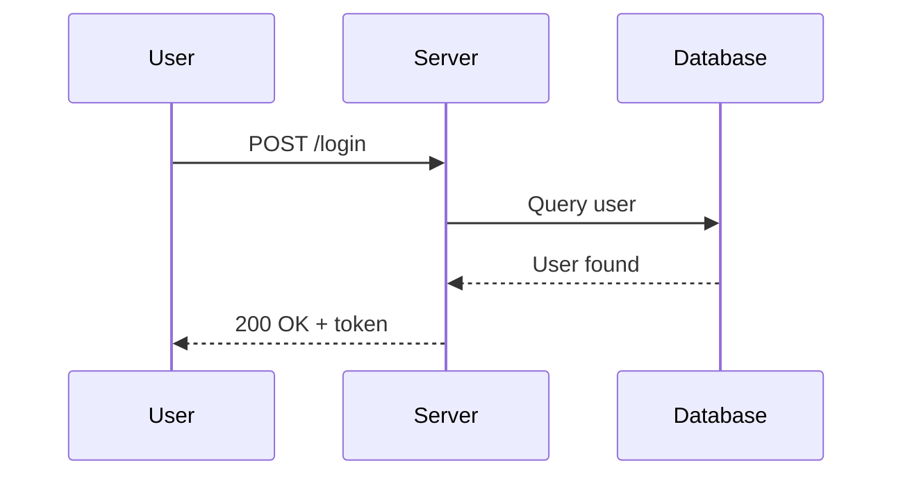
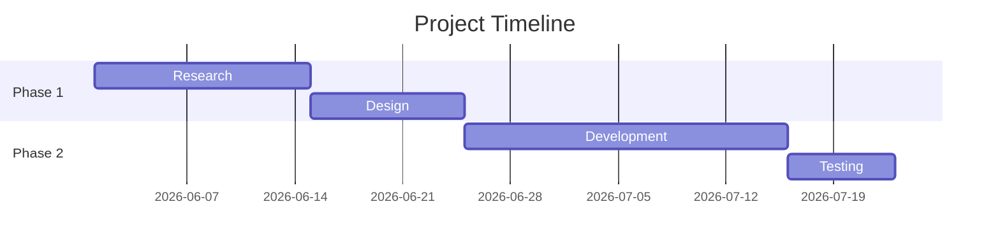
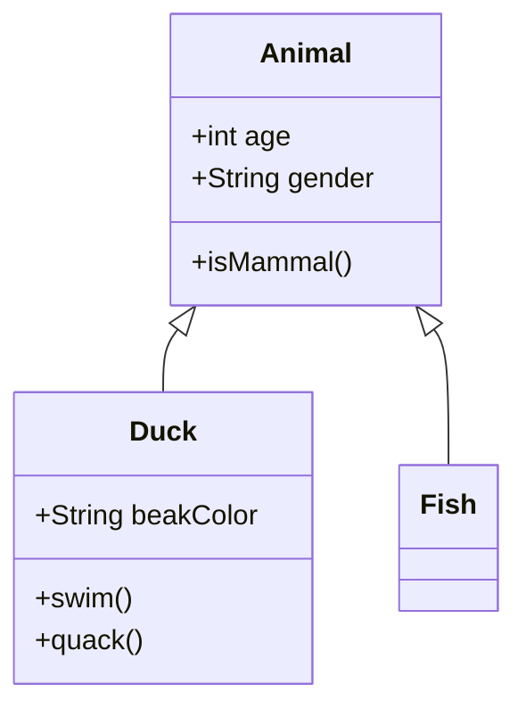
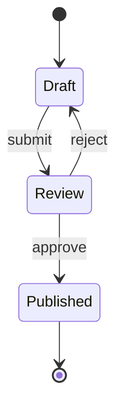
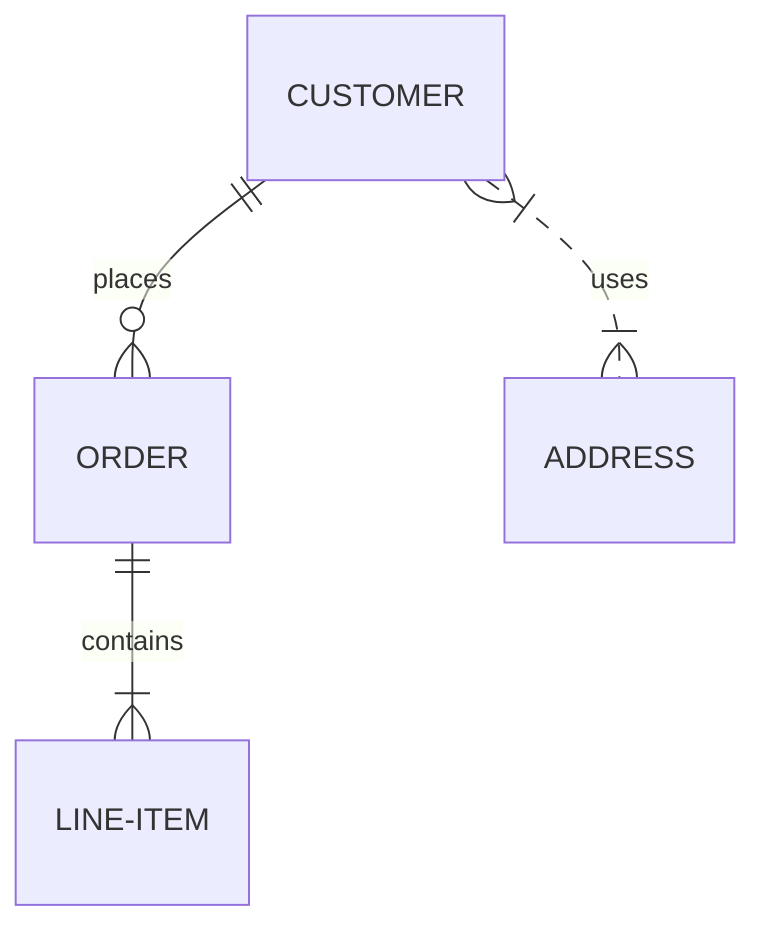

# Obsidian: The Complete Tutorial

> A comprehensive guide to Obsidian — the local-first, Markdown-based knowledge management tool.
> Version: June 2026 | Obsidian v1.13.x

---

## Table of Contents

1. [What Is Obsidian?](#1-what-is-obsidian)
2. [Installation and Setup](#2-installation-and-setup)
3. [Vault Basics](#3-vault-basics)
4. [Markdown Syntax in Obsidian](#4-markdown-syntax-in-obsidian)
5. [Wikilinks and Internal Linking](#5-wikilinks-and-internal-linking)
6. [Embeds and Transclusion](#6-embeds-and-transclusion)
7. [Block References](#7-block-references)
8. [Callouts](#8-callouts)
9. [Properties and Frontmatter](#9-properties-and-frontmatter)
10. [Tags](#10-tags)
11. [Graph View](#11-graph-view)
12. [Canvas](#12-canvas)
13. [Templates and Daily Notes](#13-templates-and-daily-notes)
14. [Dataview Plugin](#14-dataview-plugin)
15. [Bases](#15-bases)
16. [Mermaid Diagrams](#16-mermaid-diagrams)
17. [Plugins Ecosystem](#17-plugins-ecosystem)
18. [Sync and Publish](#18-sync-and-publish)
19. [CSS Snippets and Customization](#19-css-snippets-and-customization)
20. [Hotkeys and Productivity](#20-hotkeys-and-productivity)
21. [Sample Vault Walkthrough](#21-sample-vault-walkthrough)
22. [Cheat Sheet](#22-cheat-sheet)

---

## 1. What Is Obsidian?

Obsidian is a **knowledge management tool** that works on plain Markdown files stored on your local device. It was launched in 2020 by Dynalist Inc. (co-founded by Shida Li and Erica Xu) and has since become one of the most popular tools in the PKM (Personal Knowledge Management) space.

### Core Philosophy

| Principle | What It Means |
|---|---|
| **Local-first** | Your notes are `.md` files on your hard drive. No lock-in, no proprietary format. |
| **Plain text** | Everything is Markdown. If Obsidian disappears tomorrow, your notes survive. |
| **Linked thinking** | Notes connect via `[[wikilinks]]`, forming a knowledge graph. |
| **Extensible** | 1,500+ community plugins turn Obsidian into anything — a task manager, a journal, a Kanban board, a CMS. |
| **Privacy-first** | No account required. Your notes never touch a server unless you choose Sync or Publish. |

### Pricing (as of June 2026)

- **Free** — personal AND commercial use, all core features, unlimited notes
- **Obsidian Sync** — $4/month (annual) for E2E encrypted sync across devices
- **Obsidian Publish** — $10/month (annual) to publish notes as a website
- **Catalyst** — one-time $25+ for insider builds (optional support tier)
- 40% discount for education and non-profit

### Who Is It For?

- Knowledge workers, researchers, writers, developers
- Anyone who values data ownership and offline access
- Tinkerers who enjoy customizing their tools
- NOT ideal for: teams needing real-time collaboration, users who want zero-setup simplicity

---

## 2. Installation and Setup

### Download

Go to [obsidian.md](https://obsidian.md) and download for your platform:
- **Windows**: `.exe` installer or portable
- **macOS**: `.dmg`
- **Linux**: AppImage, Flatpak, or Snap
- **iOS / Android**: App Store / Google Play

### Creating Your First Vault

1. Launch Obsidian.
2. Click **"Create new vault"**.
3. Choose a name and folder location (e.g., `~/Documents/MyVault`).
4. Obsidian opens your empty vault.

### Recommended Initial Settings

Go to **Settings** (gear icon, bottom left):

| Setting | Recommendation |
|---|---|
| **Editor > Default view** | Live Preview (WYSIWYG markdown) |
| **Files & Links > Default location for new notes** | "In the folder specified below" (create a root folder) |
| **Files & Links > New link format** | "Shortest path when possible" |
| **Files & Links > Use [[Wikilinks]]** | ON (default) |
| **Files & Links > Automatically update internal links** | ON |
| **Appearance > Theme** | Pick one you like; "Minimal" and "Things" are popular |
| **Core Plugins > Daily Notes** | ON |
| **Core Plugins > Templates** | ON |
| **Core Plugins > Canvas** | ON |

---

## 3. Vault Basics

### What Is a Vault?

A **vault** is just a folder on your filesystem containing Markdown (`.md`) files, attachments, and a hidden `.obsidian/` config folder.

```
MyVault/
├── .obsidian/          # Config, plugins, themes, settings
│   ├── app.json
│   ├── community-plugins.json
│   ├── core-plugins.json
│   ├── themes/
│   ├── snippets/
│   └── ...
├── daily-notes/
│   └── 2026-06-18.md
├── projects/
│   ├── project-alpha.md
│   └── project-beta.md
├── attachments/
│   └── diagram.png
└── README.md
```

### The Interface

```
┌──────────────────────────────────────────────┐
│  [Sidebar Tabs]  │    Main Editor Pane       │
│                  │                           │
│  - Files         │    ## My Note             │
│  - Search        │    Content here...        │
│  - Bookmarks     │                           │
│  - Tags          │                           │
│  - Graph         │                           │
│                  │                           │
└──────────────────────────────────────────────┘
│  [Status Bar: word count, backlinks, etc.]   │
└──────────────────────────────────────────────┘
```

### Basic Operations

| Action | How |
|---|---|
| Create note | `Ctrl/Cmd+N` or click "New note" |
| Open quick switcher | `Ctrl/Cmd+O` → type filename |
| Command palette | `Ctrl/Cmd+P` → search any command |
| Open settings | `Ctrl/Cmd+,` |
| Toggle left sidebar | `Ctrl/Cmd+Shift+L` (hold Ctrl/Cmd to toggle) |
| Toggle right sidebar | `Ctrl/Cmd+Shift+R` |
| Open graph view | `Ctrl/Cmd+G` |
| Open another vault | Bottom-left vault switcher |

### Files and Paths

Obsidian resolves links relative to the vault root. You don't need to include paths when linking — just the filename is enough.

---

## 4. Markdown Syntax in Obsidian

Obsidian supports **standard CommonMark** plus **GitHub Flavored Markdown (GFM)** extensions, plus its own syntax.

### Standard Markdown

```markdown
# Heading 1
## Heading 2
### Heading 3
#### Heading 4
##### Heading 5
###### Heading 6

**bold text**
*italic text*
***bold italic***
~~strikethrough~~
==highlighted text==         ← Obsidian extension
`inline code`

- Unordered list item
  - Nested item

1. Ordered list item
2. Second item

- [ ] Open task
- [x] Completed task

[External link](https://obsidian.md)


> Blockquote
> Multi-line

---  ← horizontal rule

| Column A | Column B |
|----------|----------|
| Row 1    | Value 1  |
| Row 2    | Value 2  |

- [x] This is a completed task  ← GFM
- [ ] This is an open task
```

### Obsidian-Specific Extensions

| Syntax | Result | Notes |
|---|---|---|
| `==highlight==` | ==highlight== | Yellow highlight |
| `%%hidden comment%%` | (hidden) | Not rendered in reading view |
| `[[Page Name]]` | Internal link | Wikilink to a note |
| `#tag` | tag | Clickable tag |
| `#nested/tag` | nested/tag | Hierarchical tag |
| `> [!note]` | Callout block | Styled block (see §8) |
| `![[embed]]` | Embed | Transclusion (see §6) |

### LaTeX Math

Obsidian uses MathJax for LaTeX math rendering:

```
Inline math: $E = mc^2$

Block math:
$$
\int_{0}^{\infty} e^{-x^2} dx = \frac{\sqrt{\pi}}{2}
$$

Matrices:
$$
\begin{bmatrix}
1 & 2 & 3 \\
4 & 5 & 6
\end{bmatrix}
$$
```

### Footnotes

```markdown
Here is a sentence with a footnote.[^1]

[^1]: This is the footnote content.
```

---

## 5. Wikilinks and Internal Linking

Wikilinks are the heart of Obsidian's "linked thinking" approach. They use double-bracket syntax to connect notes by filename.

### Basic Wikilinks

| Syntax | What It Does |
|---|---|
| `[[Note Name]]` | Link to a note by filename |
| `[[Note Name\|Display Text]]` | Link with custom label (pipe alias) |
| `[[Note Name#Heading]]` | Link to a specific heading inside a note |
| `[[Note Name#^block-id]]` | Link to a specific block (paragraph/list item) |

### Practical Examples

From our sample vault:

```markdown
See [[Project Alpha]] for more details.
See [[Project Alpha|the Alpha project]] for more details.
Jump to [[Project Alpha#Timeline]].
Reference: [[Project Alpha#^key-metric]]
```

### Auto-Completion

Type `[[` and Obsidian shows a fuzzy-search dropdown of all notes in your vault. Start typing the name and press Enter to select.

### Creating Notes by Linking

Type `[[New Note Name]]` for a note that doesn't exist yet. Click the link (shown dimmed) and Obsidian creates the file automatically. This enables a "link first, write later" workflow.

### Link Auto-Update

When you rename a note, Obsidian automatically updates all `[[links]]` pointing to it (if **Files & Links > Automatically update internal links** is ON).

### Wikilinks vs Markdown Links

| Feature | Wikilinks `[[note]]` | Markdown `[text](note.md)` |
|---|---|---|
| Auto-complete | Yes | No |
| Auto-update on rename | Yes | No |
| Portable to other editors | No (renders as plain text) | Yes |
| Preferred for... | Internal vault navigation | Export/sharing with non-Obsidian users |

---

## 6. Embeds and Transclusion

Prepend `!` to any wikilink to **embed** the target inline — its content is rendered inside the current note.

### Embed Types

```markdown
![[Note Name]]           ← Embed entire note
![[Note#Heading]]        ← Embed a specific section
![[Note#^block-id]]      ← Embed a single block
![[image.png]]           ← Embed an image
![[image.png|400]]       ← Embed image with width (pixels)
![[document.pdf]]        ← Embed a PDF
![[audio.mp3]]           ← Embed audio (shows player)
![[video.mp4]]           ← Embed video (shows player)
```

### Practical Example

File: `meetings/2026-06-18-standup.md`

```markdown
# Standup - June 18, 2026

## Project Alpha Update
![[Project Alpha#Status]]
![[Project Alpha#Timeline]]
```

This embeds the Status and Timeline sections from `Project Alpha.md` directly into your meeting notes — always up-to-date with the source.

---

## 7. Block References

A **block** is a single paragraph, list item, quote, or heading. You can reference specific blocks across notes.

### Creating a Block ID

Add `^block-id` at the end of a line:

```markdown
This is a paragraph I want to reference. ^key-para

- This list item is important ^important-item
```

### Referencing Blocks

```markdown
See [[Note Name#^key-para]] for the key insight.
```

Type `^` after a note name in a wikilink and Obsidian shows available block IDs.

### Embedding Blocks

```markdown
![[Note Name#^key-para]]
```

---

## 8. Callouts

Callouts are styled blockquotes for highlighting, grouping, and organizing content visually.

### Basic Syntax

```markdown
> [!note] Title text
> Body content here.
> - Can include bullets
> - And [[wikilinks]]
```

### Built-in Callout Types

| Type | Icon | Default Color | Use Case |
|---|---|---|---|
| `[!note]` | 📝 | Blue | General note |
| `[!info]` | ℹ️ | Blue | Informational |
| `[!tip]` | 💡 | Green | Tip / best practice |
| `[!hint]` | 💡 | Green | Synonym for tip |
| `[!important]` | ❗ | Green | Important callout |
| `[!success]` | ✅ | Green | Success / done |
| `[!question]` | ❓ | Yellow | Question / FAQ |
| `[!warning]` | ⚠️ | Orange | Warning |
| `[!caution]` | ⚠️ | Orange | Synonym for warning |
| `[!danger]` | 🔥 | Red | Danger / error |
| `[!error]` | ❌ | Red | Error |
| `[!failure]` | ❌ | Red | Failure |
| `[!bug]` | 🐛 | Red | Bug report |
| `[!example]` | 📋 | Purple | Example |
| `[!quote]` | 💬 | Gray | Quotation |
| `[!abstract]` | 📄 | Blue | Summary / TL;DR |
| `[!summary]` | 📄 | Blue | Synonym for abstract |
| `[!tldr]` | 📄 | Blue | TL;DR |

### Folding (Collapsible Callouts)

```markdown
> [!note]- Folded by default
> This content is hidden until the user clicks.

> [!tip]+ Expanded by default, but foldable
> This content is visible, but can be collapsed.
```

### Custom Titles

```markdown
> [!warning] Deployment Checklist
> - [ ] Run tests
> - [ ] Backup database
> - [ ] Notify team
```

### Nested Callouts

```markdown
> [!note] Outer callout
> Outside content.
>
> > [!warning] Inner callout
> > Nested warning.
```

### Callouts with Code Blocks and Lists

```markdown
> [!example] Example with code
> Here is some code:
> ```python
> def hello():
>     print("Hello, Obsidian!")
> ```
>
> And a checklist:
> - [x] Write tests
> - [ ] Deploy
```

---

## 9. Properties and Frontmatter

Properties are structured metadata stored as **YAML frontmatter** at the top of a note. They power search, filtering, Dataview queries, and Bases.

### Basic YAML Frontmatter

```yaml
---
title: My Note
created: 2026-06-18
updated: 2026-06-18
status: in-progress
priority: high
rating: 4
tags:
  - project
  - active
aliases:
  - MyNote
  - MN
cssclasses:
  - custom-note-style
---
```

### Property Types

| Type | Example | Notes |
|---|---|---|
| **Text** | `status: active` | Single-line text |
| **Number** | `rating: 4` | Numeric, can be sorted/filtered |
| **Checkbox** | `completed: true` | Boolean yes/no |
| **Date** | `due: 2026-06-18` | ISO format date |
| **Date & time** | `meeting: 2026-06-18T14:00` | Date with time |
| **List** | `tools: [git, docker, python]` | Array of values |
| **Tags** | `tags: [project, active]` | Built-in; proper YAML list format |
| **Aliases** | `aliases: [alt1, alt2]` | Alternative names for wikilink resolution |
| **CSS Classes** | `cssclasses: [custom]` | Apply CSS snippet to this note |

### Default Properties

Three properties are built into every note:

- **`tags`** — note-level tags (visible in Tags pane)
- **`aliases`** — alternative names (used for wikilink resolution)
- **`cssclasses`** — apply custom CSS snippets

### Important Format Rules

```yaml
# CORRECT — YAML list format (Obsidian 1.4+)
tags:
  - project
  - active

# WRONG — old comma-separated format (deprecated since 1.9)
tags: project, active
```

### The Properties Panel

Open a note and you'll see a **Properties** panel above the content. It provides a form UI for editing frontmatter without touching raw YAML:

- Click `+` to add a property
- Choose a type from the dropdown
- Edit values inline
- Obsidian handles YAML serialization automatically

### Global Property Types

Go to **Settings > Properties view** to define global property types. For example, set `due` as Date and `rating` as Number once — all notes respect it.

---

## 10. Tags

Tags are a lightweight way to categorize notes. They work across the vault and are indexed automatically.

### Tag Syntax

```markdown
#tag
#nested/subtag
#project/active
#status/done
```

Tags can be placed:
- In the body of a note
- In YAML frontmatter (`tags:` list)

### The Tag Pane

Enable **Core Plugins > Tag pane** to get a sidebar listing all tags with counts. Click a tag to search for all notes with that tag.

### Searching by Tag

```
tag:#project
tag:#status/done
```

### Tag Conventions

| Pattern | Example | Use Case |
|---|---|---|
| Flat tags | `#todo`, `#idea` | Simple categorization |
| Nested tags | `#project/active`, `#project/completed` | Status workflows |
| Area tags | `#work`, `#personal`, `#learning` | Life areas |

---

## 11. Graph View

Graph View is Obsidian's signature visualization — an interactive network of your notes as nodes connected by links.

### Opening Graph View

- `Ctrl/Cmd+G` — open graph
- Click "Open graph view" in the sidebar

### Graph Features

| Feature | What It Shows |
|---|---|
| **Nodes** | Each note is a dot; size = more connections |
| **Edges** | Links between notes |
| **Colors** | Grouped by folder, tag, or path |
| **Filters** | Include/exclude by path, tag, or search |
| **Depth** | How many link-hops to display |
| **Local graph** | Graph for a single note (right sidebar) |
| **Timelapse** | Animate note creation over time |

### Graph Settings

```
Settings > Graph View:
- Depth: 1-5 (more depth = more nodes visible)
- Center force, repel force, link force — adjust layout
- Groups — color nodes by folder, tag, or search match
```

### Interpretation

- **Large nodes** = hub notes with many inbound links
- **Orphan nodes** = notes with no links — candidates for connection
- **Clusters** = topic areas with dense internal connections
- **Bridges** = notes connecting otherwise separate clusters

### Local Graph

Open a note, then in the right sidebar click "Local graph" (or enable **Core Plugins > Local graph**). Shows only connections to/from the current note.

---

## 12. Canvas

Canvas is a built-in **infinite visual workspace** for brainstorming, mind-mapping, and spatial note arrangement. Files are stored as `.canvas` (JSON Canvas open format).

### Creating a Canvas

- Click "New canvas" in the sidebar, or
- `Ctrl/Cmd+P` → "Canvas: Create new canvas"

### Canvas Elements

| Element | Description |
|---|---|
| **Text card** | Freeform text, like a sticky note |
| **Note card** | Embeds an existing note (live, editable) |
| **Media card** | Embeds image, video, PDF, or audio |
| **Web card** | Embeds a webpage (interactive iframe) |
| **Group** | Color-labeled box to group cards visually |

### Operations

| Action | How |
|---|---|
| Add text card | Double-click empty space |
| Add note card | Drag from file explorer |
| Connect cards | Hover card edge → drag dot to another card |
| Label connection | Click line → add label |
| Change line style | Click line → color, arrow direction |
| Group cards | Select 2+ cards → right-click → "Create group" |
| Convert card to note | Right-click → "Convert to file..." |
| Zoom | Ctrl/Cmd+scroll |
| Pan | Hold Space+drag or middle-click+drag |

### Canvas File Format (JSON Canvas)

```json
{
  "nodes": [
    {
      "id": "a1",
      "type": "text",
      "text": "**Brainstorm**: Feature ideas",
      "x": 0,
      "y": 0,
      "width": 300,
      "height": 200
    },
    {
      "id": "a2",
      "type": "file",
      "file": "projects/project-alpha.md",
      "x": 400,
      "y": 0,
      "width": 400,
      "height": 300
    }
  ],
  "edges": [
    {
      "id": "e1",
      "fromNode": "a1",
      "toNode": "a2",
      "label": "informs"
    }
  ]
}
```

### Use Cases

- **Brainstorming**: Dump ideas as cards, arrange spatially, connect related ones
- **Project planning**: Cards for features, milestones, dependencies
- **Research synthesis**: One card per source, group by theme
- **Mind mapping**: Central concept → radiating subtopics with labeled edges
- **Storyboarding**: Arrange scenes/chapters on a timeline

### Canvas vs Graph View

| | Canvas | Graph View |
|---|---|---|
| Layout control | Manual | Automatic |
| Read/write | Editable | Read-only |
| Purpose | Active thinking / planning | Visualizing existing links |
| Built with | Intentional arrangement | Automatic link detection |

---

## 13. Templates and Daily Notes

### Core Templates Plugin

The built-in **Templates** core plugin provides basic variable substitution.

**Enable**: Settings > Core Plugins > Templates (ON)
**Template folder**: Create a `templates/` folder, set in Templates settings

#### Core Template Syntax

```markdown
# {{title}}
Created: {{date:YYYY-MM-DD}}
Time: {{time:HH:mm}}

## Notes
```

#### Inserting a Template

- `Ctrl/Cmd+P` → "Templates: Insert template"
- Or set a hotkey

### Templater Plugin (Community)

The **Templater** community plugin adds programming-like power: JavaScript expressions, interactive prompts, date math, and automatic template insertion.

**Install**: Community Plugins > Browse > "Templater" > Install > Enable

#### Templater Syntax

```markdown
<% tp.date.now("YYYY-MM-DD") %>              ← Today's date
<% tp.date.now("dddd, MMMM Do YYYY") %>      ← Formatted: "Thursday, June 18th 2026"
<% tp.date.yesterday("YYYY-MM-DD") %>         ← Yesterday
<% tp.date.tomorrow("YYYY-MM-DD") %>          ← Tomorrow
<% tp.file.title %>                           ← Current file title
<% tp.file.folder() %>                        ← Current folder
<% tp.system.prompt("Enter name:") %>         ← Interactive prompt
<% tp.system.suggester(["A","B"], ["A","B"]) %> ← Pick list
```

#### Daily Note Template Example (Templater)

File: `templates/daily-note.md`
See also: [`sample-vault/templates/daily-note.md`](sample-vault/templates/daily-note.md)

```markdown
---
created: <% tp.date.now("YYYY-MM-DD") %>
tags: [daily-notes]
---

# <% tp.date.now("dddd, MMMM Do, YYYY") %>

> Day <% tp.date.now("DDD") %> of <% tp.date.now("YYYY") %>

## 🎯 Today's Focus
- [ ] Priority 1
- [ ] Priority 2
- [ ] Priority 3

## 📝 Notes

## 📅 Meetings
```dataview
TABLE file.cday as Created
FROM "meetings"
WHERE file.cday = date(<% tp.date.now("YYYY-MM-DD") %>)
```

## 🔗 Quick Links
- [[<% tp.date.yesterday("YYYY-MM-DD") %>|← Yesterday]]
- [[<% tp.date.tomorrow("YYYY-MM-DD") %>|Tomorrow →]]

## 🌙 Evening Reflection
- What went well?
- What could improve?
- Key takeaway:
```

### Daily Notes Plugin

**Enable**: Settings > Core Plugins > Daily Notes (ON)

**Settings**:
- **Date format**: `YYYY-MM-DD` (recommended)
- **New file location**: `daily-notes/` folder
- **Template file location**: `templates/daily-note.md`
- **Open daily note on startup**: ON (optional)

---

## 14. Dataview Plugin

**Dataview** is a community plugin that turns your vault into a queryable database. It reads metadata (frontmatter, inline fields, tags, tasks) and renders dynamic tables, lists, and task boards.

### Installation

Community Plugins > Browse > "Dataview" > Install > Enable

### How Dataview Works

1. You add metadata to notes (properties, inline fields, tags)
2. You write a Dataview query in a code block
3. Dataview renders a live view that updates automatically

### Metadata Sources

```markdown
# In frontmatter (YAML)
---
status: active
priority: 1
due: 2026-06-30
tags: [project]
---

# Inline fields (double-colon syntax)
Author:: Jane Smith
Rating:: 5
Genre:: fiction

# Inline fields (bracketed)
[pages:: 342]
```

### Query Types

#### TABLE Query

```dataview
TABLE status, priority, due
FROM "projects"
WHERE status = "active"
SORT priority ASC
```

#### LIST Query

```dataview
LIST
FROM #project AND "projects"
SORT file.name ASC
```

#### TASK Query

```dataview
TASK
FROM "daily-notes"
WHERE !completed AND due <= date(today)
SORT due ASC
```

#### CALENDAR Query

```dataview
CALENDAR due
FROM "projects"
```

### Inline Queries (DQL)

Use backtick-equals syntax for inline results:

```markdown
Active projects: `$= dv.pages('"projects"').where(p => p.status == "active").length`
```

### Query Language Reference

| Clause | Purpose | Example |
|---|---|---|
| `FROM` | Filter source | `FROM "projects"` or `FROM #tag` |
| `WHERE` | Filter rows | `WHERE priority > 2 AND status != "done"` |
| `SORT` | Sort results | `SORT due ASC, priority DESC` |
| `GROUP BY` | Group rows | `GROUP BY status` |
| `LIMIT` | Limit results | `LIMIT 10` |
| `FLATTEN` | Unnest arrays | `FLATTEN tags` |

### Built-in Implicit Fields

| Field | Meaning |
|---|---|
| `file.name` | Filename without extension |
| `file.path` | Full path from vault root |
| `file.link` | Wikilink to the file |
| `file.cday` | Creation date |
| `file.mday` | Last modified date |
| `file.tags` | All tags in the note |
| `file.tasks` | All tasks in the note |

### DataviewJS (Advanced)

For complex queries, use JavaScript:

````markdown
```dataviewjs
const active = dv.pages('"projects"').where(p => p.status == "active");
dv.table(
  ["Project", "Priority", "Due"],
  active.map(p => [p.file.link, p.priority, p.due])
);
```
````

---

## 15. Bases

**Bases** is a core plugin (Obsidian 1.9+, August 2025) that provides database-like views over your notes. Think of it as a Notion database, but local and offline.

### What Bases Does

- **Filters and sorts** notes by their Properties
- Displays notes as **tables, cards, or lists**
- Saves configurations in `.base` files
- Completely offline — no server needed

### Creating a Base

1. `Ctrl/Cmd+P` → "Bases: Create new base"
2. Name it (e.g., "Projects Database")
3. Configure filters and columns
4. Switch between Table, Card, and List views

### Filtering in Bases

| Filter | Meaning |
|---|---|
| `status = "active"` | Only active items |
| `priority >= 3` | High-priority only |
| `due > 2026-01-01` | Due this year only |
| `tags contains "project"` | Has project tag |

### Bases vs Dataview vs Notion

| Feature | Bases | Dataview | Notion Database |
|---|---|---|---|
| Built-in | Yes (core) | Plugin required | Yes |
| Views | Table, Card, List | Table, List, Task, Calendar | Table, Board, Timeline, Calendar, Gallery |
| Learning curve | Low (GUI-driven) | Medium (query language) | Low |
| Offline | Yes | Yes | Limited |
| Data format | `.md` + `.base` files | `.md` files | Proprietary |
| Cost | Free | Free | Paid above limits |

---

## 16. Mermaid Diagrams

Obsidian natively supports **Mermaid** diagrams — create flowcharts, sequence diagrams, Gantt charts, and more using text-based syntax inside code blocks.

### Flowchart

````markdown

````

Renders as:

```
    ┌────────┐     ┌──────────┐     ┌───────┐
    │  Start │────▶│ Decision │──Yes▶│ Do X  │──┐
    └────────┘     └──────────┘     └───────┘  │
                        │                      ▼
                        │ No              ┌────────┐
                        └────────────────▶│  End   │
                                          └────────┘
```

### Sequence Diagram

````markdown

````

### Gantt Chart

````markdown

````

### Class Diagram

````markdown

````

### State Diagram

````markdown

````

### Entity Relationship Diagram

````markdown

````

### Flowchart Node Shapes

| Syntax | Shape |
|---|---|
| `A[Rectangle]` | Rectangle |
| `A(Rounded)` | Rounded rectangle |
| `A([Stadium])` | Stadium shape |
| `A[[Subroutine]]` | Subroutine |
| `A[(Database)]` | Cylinder / database |
| `A((Circle))` | Circle |
| `A>Asymmetric]` | Flag |
| `A{Rhombus}` | Diamond / decision |
| `A{{Hexagon}}` | Hexagon |

---

## 17. Plugins Ecosystem

Obsidian's plugin system is what makes it transformative. With 1,500+ community plugins, Obsidian can become almost any tool.

### Core Plugins (Official)

These ship with Obsidian and can be toggled in Settings > Core Plugins:

- Audio recorder, Backlinks, Bookmarks, Canvas, Command palette, Daily notes, File explorer, File recovery, Graph view, Note composer, Outgoing links, Outline, Page preview, Publish, Quick switcher, Random note, Search, Slash commands, Slides, Starred, Sync, Tag pane, Templates, Word count, Workspaces, and more.

### Essential Community Plugins

| Plugin | What It Does | Why Install |
|---|---|---|
| **Dataview** | Query your vault like a database | Dashboards, task aggregation, dynamic lists |
| **Templater** | Advanced template automation | Dynamic dates, prompts, auto-apply by folder |
| **Calendar** | Visual calendar for daily notes | Navigate daily/weekly notes visually |
| **Tasks** | Advanced task management | Due dates, recurrence, priority, filtering |
| **QuickAdd** | Macro/automation engine | Capture to specific notes, run scripts |
| **Kanban** | Kanban boards in notes | Project management, visual task tracking |
| **Excalidraw** | Hand-drawn style diagrams | Visual note-taking, sketching |
| **Advanced Tables** | Better table editing | Tab navigation, auto-format, formulas |
| **Paste URL into selection** | Smart link pasting | Select text → paste URL → becomes markdown link |
| **Omnisearch** | Better search | Fuzzy search, PDF content, OCR |
| **Style Settings** | Theme customization | Adjust theme colors, fonts, spacing |
| **Obsidian Git** | Git backup | Auto-commit vault to Git |

### Installing Plugins

1. Settings > Community Plugins > Turn off Restricted Mode (first time)
2. Click "Browse"
3. Search for the plugin name
4. Click "Install" → "Enable"

### Plugin Safety

- Community plugins run with full vault access
- Check the GitHub repo: stars, recent commits, open issues
- Prefer plugins with high download counts and active maintenance
- Safe Mode/Restricted Mode disables all community plugins
- The new **Community Directory** (May 2026) has automated review

---

## 18. Sync and Publish

### Obsidian Sync ($4/month annual)

End-to-end encrypted sync across devices.

**Features**:
- E2E encrypted (zero-knowledge — Obsidian can't read your notes)
- Version history (1 year)
- Selective sync (choose which folders)
- Background sync on mobile (2026)
- Headless client for servers (2026)

**Setup**:
1. Settings > Sync > Sign in
2. Choose a remote vault name
3. Connect other devices with the same account
4. Configure selective sync

### Free Sync Alternatives

| Method | Pros | Cons |
|---|---|---|
| **iCloud** (macOS/iOS) | Free, built-in | Mac-only for good experience |
| **Git** (GitHub/GitLab) | Free, version control | Manual commit/pull, merge conflicts |
| **Syncthing** | Free, P2P, cross-platform | Setup required |
| **Dropbox/Google Drive** | Simple | .obsidian/ conflicts, no mobile |
| **Obsidian Git plugin** | Auto-commit, auto-pull | Still needs a Git remote |

### Obsidian Publish ($10/month annual)

Turn your vault into a public website.

**Features**:
- Custom domain
- Password protection (per-page or site-wide)
- SEO optimization (meta tags, social preview)
- Graph view on the published site
- Search
- Backlinks
- Themes

**Usage**:
1. Settings > Publish > Sign in
2. Click publish icon on any note → "Publish"
3. Configure site settings for domain, theme, password

---

## 19. CSS Snippets and Customization

### Themes

Settings > Appearance > Themes > Browse → 100+ community themes. Popular ones:
- **Minimal** — clean, distraction-free
- **Things** — macOS-inspired
- **AnuPpuccin** — highly customizable
- **Catppuccin** — pastel color scheme
- **Tokyo Night** — dark, moody

### CSS Snippets

CSS snippets let you override specific styles without changing themes.

1. Settings > Appearance > CSS snippets > Open snippets folder
2. Create a `.css` file (e.g., `custom.css`)
3. Add your CSS overrides
4. Toggle the snippet ON in settings

#### Useful Snippets

```css
/* Wider readable line width */
.markdown-source-view, .markdown-preview-view {
    max-width: 900px;
}

/* Make Mermaid diagrams responsive */
.mermaid svg {
    max-width: 100%;
    height: auto;
}

/* Custom callout colors */
.callout[data-callout="my-custom"] {
    --callout-color: 200, 100, 200;
}

/* Hide specific UI elements */
.workspace-ribbon { display: none; }
```

### Using cssclasses

Add `cssclasses: [my-snippet]` to a note's frontmatter, then create `my-snippet.css` in the snippets folder. The snippet's styles apply only to that note.

---

## 20. Hotkeys and Productivity

### Essential Hotkeys

| Shortcut | Action |
|---|---|
| `Ctrl/Cmd+N` | New note |
| `Ctrl/Cmd+O` | Quick switcher |
| `Ctrl/Cmd+P` | Command palette |
| `Ctrl/Cmd+E` | Toggle edit/reading view |
| `Ctrl/Cmd+,` | Settings |
| `Ctrl/Cmd+G` | Graph view |
| `Ctrl/Cmd+Shift+F` | Search all files |
| `Ctrl/Cmd+F` | Search current file |
| `Ctrl/Cmd+Click` | Open link in new pane |
| `Ctrl/Cmd+Shift+D` | Create daily note |
| `Ctrl/Cmd+W` | Close current tab |
| `Ctrl/Cmd+Shift+T` | Reopen closed tab |
| `Ctrl/Cmd+\`` | Toggle left sidebar |
| `Ctrl/Cmd+Shift+\`` | Toggle right sidebar |
| `F2` | Rename file |
| `Ctrl/Cmd+;` | Open properties panel |

### Productivity Tips

1. **Quick Switcher as launcher**: `Ctrl/Cmd+O` → type filename → Enter. Faster than file explorer.
2. **Command Palette everything**: `Ctrl/Cmd+P` → type any action. Learn the commands, not the menus.
3. **Pane management**: Split panes with `Ctrl/Cmd+Click` links. Drag tabs to arrange.
4. **Workspaces**: Save pane layouts as workspaces (Core Plugin). Switch between "writing", "planning", "research" layouts.
5. **Starred/Bookmarks**: Bookmark frequently-used notes and searches.
6. **Tab stacks**: Group related tabs. In settings, enable "Stack tabs".
7. **Note Composer**: Merge or split notes (`Ctrl/Cmd+P` → "Note composer").
8. **Slash commands**: Type `/` in a note for quick formatting commands (enable core plugin).

---

## 21. Sample Vault Walkthrough

The `sample-vault/` directory in this tutorial contains a working Obsidian vault with example files demonstrating all concepts.

### Structure

```
sample-vault/
├── .obsidian/                    # Obsidian config (minimal)
├── daily-notes/
│   └── 2026-06-18.md             # Example daily note
├── templates/
│   ├── daily-note.md             # Templater daily note template
│   └── meeting-note.md           # Meeting template
├── projects/
│   ├── project-alpha.md          # Active project with full frontmatter
│   ├── project-beta.md           # Completed project
│   └── project-dashboard.md      # Dataview dashboard of all projects
├── books/
│   ├── atomic-habits.md          # Book note with rating, genre
│   └── deep-work.md              # Another book note
├── meetings/
│   └── 2026-06-18-standup.md     # Meeting note with embeds
├── concepts/
│   ├── linked-thinking.md        # Concept note with wikilinks
│   └── zettelkasten.md           # Methodology note
├── assets/
│   └── (place images here)
└── project-canvas.canvas         # Canvas file for visual planning
```

### Key Files to Explore

| File | Demonstrates |
|---|---|
| `projects/project-alpha.md` | Properties, tags, frontmatter, inline fields |
| `projects/project-dashboard.md` | Dataview TABLE query, dynamic dashboard |
| `meetings/2026-06-18-standup.md` | Embeds, transclusion, cross-referencing |
| `concepts/linked-thinking.md` | Wikilinks, backlinks, concept documentation |
| `books/atomic-habits.md` | Book note template with rating, genre, status tracking |
| `daily-notes/2026-06-18.md` | Daily note with tasks, reflections |
| `project-canvas.canvas` | Canvas with text cards, note cards, connections |
| `templates/daily-note.md` | Templater template with dynamic dates, Dataview |
| `templates/meeting-note.md` | Meeting template with attendees, agenda, actions |

### Creating the Sample Vault in Obsidian

1. Open Obsidian
2. Click "Open folder as vault"
3. Navigate to `obsidian_tutorial/sample-vault/`
4. All sample files are ready to explore

---

## 22. Cheat Sheet

### Markdown

```markdown
# H1 to ###### H6
**bold** *italic* ***bold italic*** ~~strike~~
==highlight==  `code`
- list  1. ordered  - [ ] task
[link](url)  [[wikilink]]  ![[embed]]
| table | ... |
> quote
%% hidden comment %%
---  ← horizontal rule
```

### Wikilinks

```
[[Note]]                    ← Link to note
[[Note|Display]]            ← Link with alias
[[Note#Heading]]            ← Link to heading
[[Note#^block]]             ← Link to block
![[Note]]                   ← Embed note
![[Note#Heading]]           ← Embed section
```

### Callouts

```
> [!note] Title
> [!info] [!tip] [!hint] [!important]
> [!success] [!question] [!warning] [!caution]
> [!danger] [!error] [!failure] [!bug]
> [!example] [!quote] [!abstract] [!summary] [!tldr]
> [!note]- Collapsed
> [!tip]+ Expanded foldable
```

### Properties

```yaml
---
title: My Note
created: 2026-06-18
status: active
priority: 2
due: 2026-07-01
rating: 4
tags: [project, active]
aliases: [alias1, alias2]
cssclasses: [custom]
---
```

### Dataview

````
```dataview
TABLE field1, field2
FROM "folder" OR #tag
WHERE field = "value"
SORT field ASC
```
````

### Hotkeys

```
Cmd/Ctrl+N    New note
Cmd/Ctrl+O    Quick switcher
Cmd/Ctrl+P    Command palette
Cmd/Ctrl+E    Toggle edit/reading
Cmd/Ctrl+,    Settings
Cmd/Ctrl+G    Graph view
Cmd/Ctrl+Shift+F  Search all
```

### Mermaid

````
```mermaid
flowchart LR / TD
sequenceDiagram
gantt
classDiagram
stateDiagram-v2
```
````

---

## Appendices

### A. File Formats

| Extension | Format | Notes |
|---|---|---|
| `.md` | Markdown note | Core format |
| `.canvas` | Canvas file | JSON Canvas spec |
| `.base` | Bases configuration | Filter/sort/display rules |
| `.css` | CSS snippet | Custom styling |
| `.json` | Configuration | `.obsidian/` folder settings |

### B. Where to Learn More

- **Official Docs**: [help.obsidian.md](https://help.obsidian.md)
- **Official Forum**: [forum.obsidian.md](https://forum.obsidian.md)
- **Obsidian Hub**: [obsidianhub.org](https://obsidianhub.org) — curated plugins, themes, workflows
- **Reddit**: [r/ObsidianMD](https://reddit.com/r/ObsidianMD)
- **YouTube**: Search "Obsidian tutorial" — massive community
- **Discord**: Obsidian Members Group

### C. Glossary

| Term | Definition |
|---|---|
| **Vault** | A folder containing your Markdown files and `.obsidian/` config |
| **Wikilink** | `[[double bracket]]` internal link syntax |
| **Backlink** | A link from another note pointing TO the current note |
| **Transclusion** | Embedding content from one note into another (`![[note]]`) |
| **Frontmatter** | YAML metadata block at the top of a note (`---` delimiters) |
| **Properties** | Typed fields in frontmatter (text, number, date, checkbox, list) |
| **Canvas** | Infinite visual whiteboard (`.canvas` file) |
| **Bases** | Database-like views over notes (table, card, list) |
| **Dataview** | Community plugin that queries note metadata |
| **Live Preview** | WYSIWYG markdown editing mode |
| **Graph View** | Visual network of linked notes |
| **Callout** | Styled blockquote (`> [!type]`) |
| **Block** | A single paragraph, list item, or quote (with optional `^block-id`) |

---

> Tutorial written June 2026. Obsidian is actively developed — check [obsidian.md/changelog](https://obsidian.md/changelog) for the latest features.
